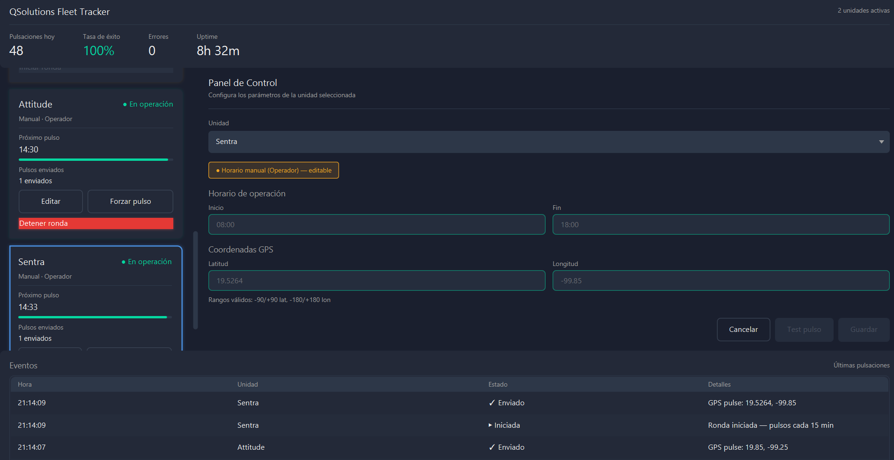

# QSolutions GPS Fleet Tracking Service

> Java-based SOAP client with a modern JavaFX desktop UI for automated GPS pulse dispatch to the QSolutions/DigiHaul logistics platform.


---



---

## The problem

A logistics company needed their fleet of 5 transport units to report GPS position to the
QSolutions/DigiHaul platform every 15 minutes during active routes. No existing tooling
handled the SOAP/XML integration their platform required, and the original solution was
a CLI-only tool that limited operator usability.

This service solves both — a Java application with a modern desktop UI for fleet
configuration and live monitoring, backed by reliable SOAP dispatch.

---

## How it works

The operator launches the desktop UI and configures each unit individually:

- Activate or deactivate the unit for today's route
- Set or review the unit's operational window (`07:00–15:00`, etc.)
- Enter GPS coordinates with real-time validation
- Trigger a manual test pulse and see the result instantly in the event log

Fleet units configured by the manager have fixed schedules with locked time fields,
while operator-configurable units allow runtime schedule editing. Every action — pulse
sent, configuration saved, error received — is recorded both in the in-app event log
and in the structured rotating log file on disk.

---

## What's new in v2.0.0 — JavaFX Desktop UI

The CLI workflow has been replaced with a full desktop interface:

- **Soft Dark theme** — modern aesthetic inspired by Linear and Vercel, easy on the eyes during long sessions
- **Reactive cards** — each fleet unit is rendered as a card with live status, schedule, last/next pulse countdown, and progress bar
- **Smart configuration panel** — selects a unit, auto-loads its data, validates coordinates in real time (lat ±90, lon ±180), locks fields for fixed-schedule units
- **Bidirectional sync** — clicking "Edit" on a card highlights it and loads its data into the panel; selecting from the dropdown highlights the matching card
- **Live event log** — every save, pulse sent, response received, or error appears immediately as a new row at the top
- **Defensive states** — units without coordinates display a warning badge; only fully configured units count as "active"
- **Per-unit test pulse** — one click sends a real SOAP pulse to QSolutions, with async background dispatch (UI never freezes), and the result is logged automatically
- **Animated UX** — fade-in cascade on load, live countdown timer, hover and focus states throughout

---

## Architecture

```
src/
└── com/qsolutions/gpsclient/
    ├── MainClient.java                       ← entry point, launches the JavaFX UI
    ├── config/
    │   └── FleetConfig.java                  ← shared singleton registry of fleet units
    ├── model/
    │   └── Unidad.java                       ← vehicle model with observable JavaFX properties
    ├── scheduler/
    │   └── FleetScheduler.java               ← pulse cycle orchestration (CLI legacy)
    ├── service/
    │   └── GpsSoapService.java               ← SOAP payload builder and dispatcher
    ├── util/
    │   └── DateUtils.java                    ← real-time XMLGregorianCalendar builder
    └── ui/
        ├── MainApplicationUI.java            ← JavaFX Application entry point
        ├── animation/
        │   └── CardAnimations.java           ← fade-in + countdown timer utilities
        ├── validator/
        │   └── CoordinateValidator.java      ← lat/lon/time validation
        ├── view/
        │   ├── DashboardView.java            ← BorderPane root layout
        │   ├── UnidadCardView.java           ← per-unit reactive card component
        │   ├── ConfigPanelView.java          ← form with real-time validation
        │   ├── StatisticsCardView.java       ← header stats (pulses, success rate, errors, uptime)
        │   └── EventLogView.java             ← TableView with auto-scroll log
        └── styles/
            └── application.css               ← 866 lines, Soft Dark theme
```

---

## Setup

### Option A — Docker (recommended for production CLI)

No Java installation required. Just Docker. Note: Docker mode runs the legacy CLI scheduler, not the desktop UI.

```bash
# 1. Clone the repository
git clone https://github.com/YaeltSnake/qsolutions-gps-soap-client.git
cd qsolutions-gps-soap-client

# 2. Configure credentials
cp config.properties.example config.properties
# Edit config.properties with your QSolutions credentials

# 3. First run — builds the image and creates the container
docker compose build --no-cache && docker compose up --no-start

# 4. Start the service (every session)
docker start -ai fleet-pulse-service
```

> `config.properties` is mounted as a volume — credentials never go inside the image.
> GPS pulse logs are saved automatically to `logs/fleet.log` with daily rotation.

### Option B — Desktop UI (Java 25 + JavaFX 21 + NetBeans)

```bash
# 1. Clone the repository
git clone https://github.com/YaeltSnake/qsolutions-gps-soap-client.git
cd qsolutions-gps-soap-client

# 2. Configure credentials
cp config.properties.example src/config.properties
# Edit src/config.properties with your QSolutions credentials

# 3. Download JavaFX 21 SDK
# Get the SDK from https://gluonhq.com/products/javafx/
# Recommended path: C:\javafx-sdk-21.0.11\

# 4. Open in NetBeans → Clean and Build → Run Project (F6)
# The desktop UI launches directly.
```

> `nbproject/project.properties` references JavaFX at `C:/javafx-sdk-21.0.11/`. If your SDK is elsewhere, update those paths.

---

## Observability

Every session event is recorded to `logs/fleet.log` with structured timestamps:

```
[2026-04-29 22:52:25] INFO  FleetScheduler — Sesion iniciada — 2 unidades activas.
[2026-04-29 22:52:25] INFO  FleetScheduler — Iniciando ronda de pulsaciones a las 22:52:25.
[2026-04-29 22:52:27] INFO  GpsSoapService — [Attitude] Pulsacion enviada — Procesado: true
[2026-04-29 22:52:30] INFO  FleetScheduler — Servicio detenido correctamente.
```

Logs rotate daily and are retained for 30 days. The `logs/` directory is mounted as a
Docker volume — log files persist across container restarts and are accessible directly
from the host machine. The desktop UI also displays a live event log at the bottom of
the window, mirroring relevant events.

---

## How to add or rename a fleet unit

Edit `FleetConfig.java`:

```java
private static final List<Unidad> UNIDADES = Arrays.asList(
    new Unidad("Peugeot", LocalTime.of(6, 0), LocalTime.of(16, 0)), // fixed schedule
    new Unidad("NuevoNombre")                                        // manual schedule
);
```

> Use the two-argument constructor for fixed schedules (Manager-defined).
> Use the one-argument constructor for manual schedules (Operator-defined).
> The `NumUnidad` value must match the Vehicle Registration Number
> configured in the DigiHaul Driver App.

---

## How to change the pulse interval

Edit the constant in `FleetScheduler.java`:

```java
private static final int INTERVALO_MINUTOS = 15; // change this value
```

---

## Tech stack

| Layer | Technology | Why |
|---|---|---|
| Language | Java JDK 25 | Enterprise-grade, strongly typed |
| UI | JavaFX 21 LTS | Native desktop, modular, themeable via CSS |
| Protocol | SOAP / JAX-WS 2.3.5 | Required by QSolutions endpoint |
| Serialization | XML + XSD | QSolutions contract definition |
| Scheduling | ScheduledExecutorService | Precise intervals, no framework overhead |
| Build | Apache Ant (NetBeans) | Lightweight, no Maven/Gradle dependency |
| Container | Docker + docker-compose | Zero-install deployment for CLI mode |
| Logging | SLF4J + Logback 1.2.12 | Structured file logging with daily rotation |

---

## Roadmap

- [x] SOAP client with XML serialization
- [x] Per-unit scheduling and individual activation
- [x] Real-time timestamp generation on every pulse
- [x] Externalized credentials via config.properties
- [x] Docker containerization — zero-install deployment
- [x] Structured logging with SLF4J/Logback — rotating file + console output
- [x] **JavaFX desktop UI for fleet management** ← v2.0.0
- [ ] Per-unit independent scheduler — each unit runs its own 15-min cycle in background ← v2.1.0
- [ ] Web dashboard with embedded Jetty
- [ ] Flespi/SinoTrack API integration for automatic coordinate sourcing
- [ ] JUnit 5 test suite + GitHub Actions CI/CD
- [ ] Spring Boot microservices migration

---

## Contributing

1. Fork the repository
2. Create a feature branch: `git checkout -b feat/your-feature`
3. Commit using conventional commits: `feat:`, `fix:`, `refactor:`, `docs:`
4. Open a pull request

---

## License

MIT — feel free to use, modify and distribute.